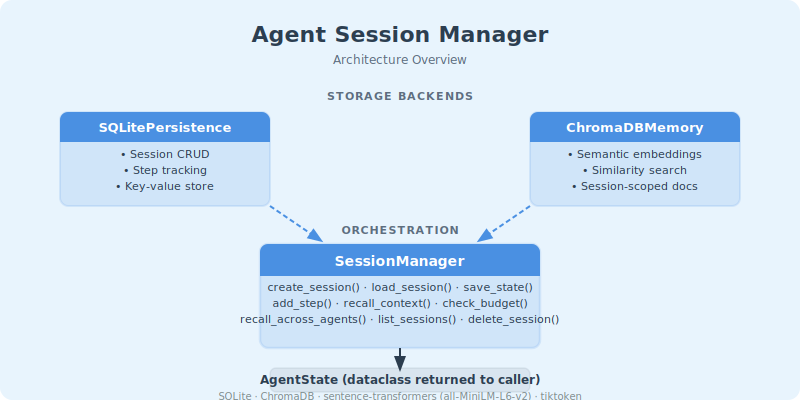

# Agent Session Manager

> Made Autonomously Using [NEO - Your Autonomous AI Engineering Agent](https://heyneo.com)
>
> [](https://marketplace.visualstudio.com/items?itemName=NeoResearchInc.heyneo)  [](https://marketplace.cursorapi.com/items/?itemName=NeoResearchInc.heyneo)

A lightweight Python library that persists agent state across sessions using SQLite and a local ChromaDB vector store. Enables semantic recall, context budget management, and multi-agent support — all without cloud dependencies.

## Architecture



## Features

- **🔄 State Persistence** — Store and restore agent sessions with goals, steps, errors, and arbitrary metadata using SQLite
- **🧠 Semantic Recall** — Retrieve past decisions by meaning using local ChromaDB embeddings + sentence-transformers
- **📏 Context Budget Guard** — Intelligently trim context to stay within token limits, prioritizing recent and relevant items
- **👥 Multi-Agent Support** — Multiple agents can share sessions and see each other's decisions
- **⚡ Fast Restore** — Full context restored in under 5 seconds
- **🔒 Local-Only** — No cloud APIs or external dependencies required

## Installation

```bash
pip install chromadb sentence-transformers tiktoken
```

Or install from requirements:

```bash
pip install -r requirements.txt
```

## Quick Start

```python
from agent_session_manager import SessionManager

# Initialize the manager
manager = SessionManager(
    db_path="./sessions.db",
    chroma_persist_dir="./chroma_db"
)

# Create a new session
state = manager.create_session(
    session_id="session-001",
    agent_id="my-agent",
    initial_goal="Build a chatbot",
    metadata={"project": "demo"}
)

# Add workflow steps
manager.add_step(
    session_id="session-001",
    action="Initialize model",
    result="GPT-4 loaded successfully"
)

# Save state
manager.save_state(state)

# Later, restore the session
restored = manager.load_session("session-001")
print(f"Goal: {restored.current_goal}")
print(f"Steps: {len(restored.completed_steps)}")

# Semantic recall
results = manager.recall_context(
    query="What model was loaded?",
    session_id="session-001",
    n_results=3
)

# Cleanup
manager.close()
```

## API Documentation

### SessionManager

The main class for managing agent sessions.

#### Constructor

```python
SessionManager(
    db_path: str = "agent_sessions.db",
    chroma_persist_dir: str = "./chroma_db",
    collection_name: str = "agent_memory",
    embedding_model: str = "all-MiniLM-L6-v2",
    default_context_budget: int = 4000,
    tokenizer_model: str = "cl100k_base"
)
```

**Parameters:**
- `db_path` — Path to SQLite database file
- `chroma_persist_dir` — Directory for ChromaDB persistence
- `collection_name` — Name of the ChromaDB collection
- `embedding_model` — Sentence-transformers model for embeddings
- `default_context_budget` — Default token budget for context
- `tokenizer_model` — Tiktoken model for token counting

#### Methods

##### `create_session(session_id, agent_id, initial_goal=None, metadata=None)`

Create a new agent session.

**Returns:** `AgentState` object

##### `load_session(session_id, context_budget=None)`

Load a session with optional context trimming.

**Returns:** `AgentState` with trimmed context

##### `save_state(state, persist_to_memory=True)`

Save agent state to persistence.

##### `add_step(session_id, action, result=None, metadata=None, index_in_memory=True)`

Add a step to a session.

**Returns:** Step number assigned

##### `recall_context(query, session_id=None, n_results=5, filter_dict=None)`

Search for semantically relevant past context.

**Returns:** List of relevant context items

##### `recall_across_agents(query, agent_ids=None, n_results=5)`

Search for context across multiple agents.

##### `list_sessions(agent_id=None, status=None)`

List all sessions with optional filtering.

##### `delete_session(session_id)`

Delete a session and all associated data.

##### `check_budget(state, budget=None)`

Check current context usage against budget.

**Returns:** Dict with `tokens`, `budget`, `usage_percent`, `remaining`, `within_budget`

### AgentState

Dataclass representing agent session state.

```python
@dataclass
class AgentState:
    session_id: str
    agent_id: str
    current_goal: Optional[str] = None
    completed_steps: List[Dict[str, Any]] = None
    pending_steps: List[str] = None
    error_history: List[Dict[str, Any]] = None
    tool_outputs: Dict[str, Any] = None
    metadata: Dict[str, Any] = None
```

## Examples

### Basic Usage

See `examples/basic_usage.py` for a complete example demonstrating:
- Session creation and persistence
- Adding workflow steps
- Session restoration across script runs
- Semantic recall for context retrieval

```bash
python examples/basic_usage.py
```

### Multi-Agent Support

See `examples/multi_agent.py` for a complete example demonstrating:
- Multiple agents with isolated sessions
- Cross-agent context sharing
- Agent-specific memory retrieval
- Context budget enforcement per agent

```bash
python examples/multi_agent.py
```

### Full Demo

Run the root `demo.py` to see all features in action:

```bash
python demo.py
```

This demonstrates:
1. State persistence across sessions
2. Semantic recall using ChromaDB
3. Context budget management with trimming
4. Multi-agent support
5. Performance verification (<5s restore)
6. Cloud dependency verification

## Context Budget Management

The library intelligently manages context size to stay within token budgets:

```python
# Load with default budget
state = manager.load_session("session-001")

# Load with custom budget (trims if necessary)
state = manager.load_session("session-001", context_budget=1000)

# Check budget usage
budget_info = manager.check_budget(state)
print(f"Usage: {budget_info['usage_percent']:.1f}%")
```

**Trimming Strategy:**
1. Always keep most recent steps
2. Remove older steps if over budget
3. Keep essential metadata and current goal

## Multi-Agent Support

Multiple agents can work independently or share context:

```python
# Create sessions for different agents
manager.create_session("session-a", agent_id="research-agent", ...)
manager.create_session("session-b", agent_id="code-agent", ...)

# Agent-specific recall
results = manager.recall_context(
    query="What was implemented?",
    session_id="session-b"  # Only code-agent's context
)

# Cross-agent search
results = manager.recall_across_agents(
    query="deployment",
    agent_ids=["research-agent", "code-agent"]
)
```

## Configuration

### Context Budgets

Set default budget in constructor:

```python
manager = SessionManager(default_context_budget=2000)
```

Override per session load:

```python
state = manager.load_session("session-001", context_budget=500)
```

### Embedding Models

Use a different sentence-transformers model:

```python
manager = SessionManager(
    embedding_model="all-mpnet-base-v2"  # Higher quality, slower
)
```

Available models: [sentence-transformers documentation](https://www.sbert.net/docs/pretrained_models.html)

### Storage Locations

```python
manager = SessionManager(
    db_path="/path/to/custom.db",
    chroma_persist_dir="/path/to/chroma"
)
```

## Tech Stack

- **Python 3.10+**
- **SQLite** — State persistence (stdlib `sqlite3`)
- **ChromaDB** — Vector storage for semantic search (local mode)
- **sentence-transformers** — Local embeddings (`all-MiniLM-L6-v2` default)
- **tiktoken** — Token counting for context budgets

## Architecture

```
┌─────────────────┐
│  SessionManager │
├─────────────────┤
│  - create_session()
│  - load_session()
│  - save_state()
│  - recall_context()
└────────┬────────┘
         │
    ┌────┴────┐
    │         │
┌───▼───┐  ┌──▼────┐
│SQLite │  │ChromaDB│
│Store  │  │Memory  │
└───────┘  └────────┘
```

- **SQLite** stores structured state: sessions, steps, key-value pairs
- **ChromaDB** stores semantic embeddings for recall
- **SessionManager** orchestrates both with context budgeting

## Error Handling

The library provides specific exceptions:

```python
from agent_session_manager import (
    SessionManager,
    SessionNotFoundError,
    SessionManagerError,
    BudgetExceededError
)

try:
    state = manager.load_session("nonexistent")
except SessionNotFoundError:
    print("Session not found")
    
try:
    state = manager.create_session("existing-id", "agent")
except SessionManagerError as e:
    print(f"Session error: {e}")
```

## Performance

- **Session creation**: <100ms
- **State restore**: <5s (even with large histories)
- **Semantic search**: <500ms for 1000 documents
- **Memory usage**: ~100MB base + model size

## Development

### Running Tests

```bash
# Test persistence layer
python -c "from agent_session_manager.persistence import test_persistence; test_persistence()"

# Test memory layer
python -c "from agent_session_manager.memory import test_memory; test_memory()"

# Test manager
python -c "from agent_session_manager.manager import test_session_manager; test_session_manager()"
```

### Project Structure

```
agent_session_manager/
├── __init__.py          # Package exports
├── persistence.py       # SQLite persistence layer
├── memory.py           # ChromaDB semantic memory
└── manager.py          # Core SessionManager

examples/
├── basic_usage.py      # Basic usage example
└── multi_agent.py      # Multi-agent example

demo.py                 # End-to-end demo
requirements.txt        # Dependencies
README.md              # This file
```

## License

MIT License

## Contributing

Contributions welcome! Please ensure:
- Code follows existing style
- Tests pass
- Documentation is updated
- No cloud dependencies are introduced
